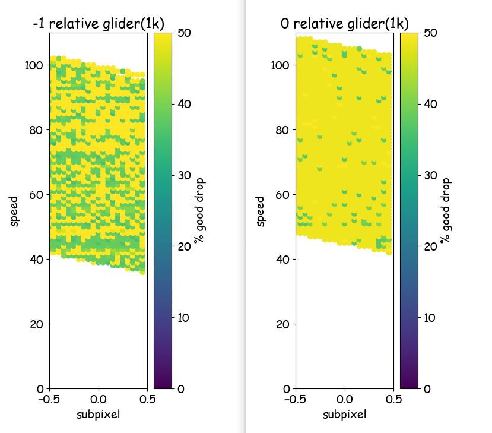

## #general info[

Takes info from the frame you drop one glider, right before picking up the other(egg! frame before a 13,g), and then generates inputs until it reaches the target x pos in whatever directoim 
can input the stuff directly, or have it auto-read from the clipboard after Copying Game Info from Celeste Studio,,, just uses the default pos/speed, and a glider pos if you ctrl click the dropped one 
if it immediately runs out of branches your starting conditions were Prolly Bad(too slow/fast) and it banished you out of love(lazy) 
there's two ''algorithms''/'"solvers'" to find inputs, but the slower almost always does better unless you've got Perfect starting conditions(usually not) 
 

## #off-topic info]

there's also an advanced settings buttonnntn if youre ADVANCEDjk. not much good in touching the scary section, but some of the others can give better results if you love waiting longer for it to solve: 
-decreasing cell size will let it track more precise routes, which can sometimes help 
-for the slow solver , increasing "extra adjustment frames" by like 1 or 2 prolly maxes it out. could increase total max adjustments too but i haven't seen it help yet 
+opposites hold true too ig. and most stuff has tooltips for the idk 
idk! have fun dont die !!!! 
oh ig there's a "use repeats" button too to make inputs use Repeat,X EndRepeat commands if possible. turns out to be pretty Useless(4now) tho so hmph
     

# 🆗 the rest of this is just whatevr on what it actually does .-
 

## #memes logistics info?? ? :p ^ ^ :/ ):

-you can move up to 13 units from a glider after dropping it and   still be able to pick it up next frame. so the solvers always try to go that full 13 between each drop(unless "player leniency" is higher) 
-additionally(pro+ for short), dropping a glider on one frame leavs it at ur position from the end of last frame. so an optimal drop wld go the full 13 units the frame before dropping, and then drop it the next frame without moving out of that pixel 
-except there's only 9 input frames per drop(ideally). so even w/ Perfect start conditions this "good drop" is only possible on ~every other drop. the solvers will always go for it, but will also settle for (slightly) worse when necessary(via "glider leniency") 
-But also most starting conditions Aren't Perfect which makes it even Worse. to FIGHT this, the slow solver will try adding extra "adjustment" frames to each drop(via "extra adjustment frames") to see if it helps. basically waste some frames to save more later from cooler pos/speeds :sunglasses 
,-,the simple solver simply does not care about any of that tho,,, so it's basically the same as having extra adjustment frames set to 0 
+++++! both will never go over 100 or under 40 speed(except the first/last drops), because i dont like the vibes of those speeds and banned them based on personal beliefs and family values 
beyond that all the program really does is try every input combo for each drop and continue if it meets the above criteria. nothing more nothing less ☺️  
       

## starting conditions/gross useless graphs???(i just like pretty images) :||||||

fwiw hard to say if this rest is real or just halucinsateited by silly goofy algs. relevant nonetheless i guess?! 

ofc, the closer you/the dropped glider's pos is to the target pos the better(wow) 
and while there's some variance, generally there's no specific subpixels that'll change ur life 
the actual Big Factor is speed, which is basically what makes a starting condition Good or whatever... 

Per the simple solver over 1k units(pretty much directly correlated to the number of good drops): 
 &   

Aaanndd the slow solver03?  . doesn't make the rich any richer, but does even out everything else:  
 &   

Which kinda lines up with the amount of adjustments ?: 
 

these show a lot of "bands" of good speeds, but the Really Good ones tend to be kinda unreachable(at least reasonably) 
For reference, here's some graphs with some (sIightly more)-easily obtainable speeds with a glider: 
 &  

nothing rly gets Banger Status, but hitting 108 speed and slowing down to certain speeds seem to do the best(clear ones frm graphs are 97.167, 86.333, 75.500, 64.667, 53.833) 
why not the other speeds from hitting 108? or the rest? who knows. beyond my iq paygrade at least! 

Also idk how to tie this in but heres a finer slice of the speeds at 0 subpixel:(???): 
  

There's some structure if you zoom in more but idk/c enough to parse it. just get lucky!!!! or look at the data yourself in "fun!!/data" idk! 
 &   